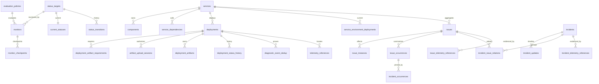

# D1 数据库实现 / D1 Database Implementation

本文定义 `moesegfault-status` 的权威领域数据库契约。它是 [`status-design.md`](./status-design.md) 与 [`observability-standard.md`](./observability-standard.md) 的实现伴随文档；列、约束与索引的最终事实来源是 [`../migrations/0001_initial.sql`](../migrations/0001_initial.sql)。

This document defines the authoritative domain database contract for `moesegfault-status`. It accompanies [`status-design.md`](./status-design.md) and [`observability-standard.md`](./observability-standard.md); the final source of truth for columns, constraints, and indexes is [`../migrations/0001_initial.sql`](../migrations/0001_initial.sql).

## 1. 设计边界 / Design boundary

| 保存于 D1 / Stored in D1 | 不保存于 D1 / Not stored in D1 |
| --- | --- |
| 当前领域判断、不可变历史、聚合计数、幂等墓碑、证据定位器、部署来源 | 原始 trace、log、metric、profile、完整 Diagnostic payload、二进制产物 |
| Service、Component、Monitor、Issue、Incident、Maintenance、Deployment | 高频 Observation；它进入 Analytics Engine |
| R2 对象键、摘要、大小、Build ID、source map 关系 | R2 对象内容、后端 UI URL 生成结果、凭据 |

D1 采用 SQLite 语义。所有业务表均为严格表（**STRICT table**），避免 JavaScript 值与 SQLite 存储类别悄然漂移；布尔值固定为 `INTEGER CHECK (... IN (0,1))`，JSON 固定为 `TEXT` 并用 `json_valid`/`json_type` 检查。Cloudflare 同样建议 D1 使用 STRICT 表，并说明 D1 原生支持 SQLite JSON 扩展：[Workers Binding API](https://developers.cloudflare.com/d1/worker-api/)、[Query JSON](https://developers.cloudflare.com/d1/sql-api/query-json/)。

### 时间契约 / Time contract

数据库的 `CHECK` 只能低成本验证时间文本具有 UTC `Z` 外形，**不能证明它是完整 RFC 3339 值**。应用边界必须解析时间，然后统一序列化为固定毫秒精度：

```text
YYYY-MM-DDTHH:mm:ss.SSSZ
```

固定宽度使 `ends_at > starts_at` 等 TEXT 比较等价于时间顺序。任何可变小数精度、时区偏移或闰秒表示都必须在进入 SQL 前规范化。此职责属于共享 Rust/TypeScript 类型，而不是 SQLite 字符串技巧。

## 2. 关系地图 / Relation map



## 3. 表族与读模型 / Table families and read models

| 表族 / Family | 写模型 / Write model | 当前读模型 / Current read model | 核心不变量 / Key invariant |
| --- | --- | --- | --- |
| 目录 | `services`, `components`, `component_services`, `service_dependencies`, `status_targets` | 同表 | `status_targets` 由 trigger 自动生成，多态引用仍有真实复合外键 |
| 策略 | `evaluation_policies`, `service_diagnostic_policies`, `data_retention_policies`, `service_retention_policies` | 精确 `(policy_id, revision)` | 策略修订不可更新/删除；选择不得靠“最大 revision”猜测 |
| 主动监控 | `monitors`, `monitor_locations`, `monitor_checkpoints` | 同表 | Monitor 租约使用有条件 `UPDATE ... RETURNING`；D1 不存 raw Observation |
| 状态 | `current_statuses`, `status_transitions`, `status_overrides` | `current_statuses` | `direct_status` 与 `dependency_risk` 分列；transition 只追加且序号连续 |
| 部署 | `deployments`, `deployment_regions`, `deployment_artifact_requirements`, `artifact_upload_sessions`, `deployment_artifacts`, `deployment_status_history`, `service_environment_deployments` | `deployment_current_status` view + current pointer | manifest/artifact 不可变；当前部署按服务和环境显式指向 ready/active deployment |
| 诊断与 Issue | `diagnostic_event_dedup`, `issues`, `issue_instances`, `issue_occurrences`, `issue_actions` | `issues` 聚合快照 | 同一未解决 fingerprint 只有一个 Issue；resolved 不可重开，只能 recurrence |
| Incident | `incidents`, `incident_updates`, 三类 `incident_*_relations`, `incident_occurrences` | `incident_current`, `incident_issues`, `incident_components`, `incident_services` views | 身份、时间线、关系事件只追加；最新 update 的 sequence 就是 OCC revision |
| 证据 | `telemetry_backends`, `telemetry_references`, Issue/Incident link tables | 按稳定 ID 连接 | locator 为结构化 JSON；`(deployment_id, service_name)` 复合外键防来源伪造 |
| 可靠交付 | `idempotency_keys`, `audit_log`, `outbox`, `transaction_assertions` | 同表 | 幂等和审计不可变；outbox 只允许改变投递状态；assertion 行自动删除 |

## 4. 关键不变量 / Critical invariants

### 4.1 Issue fingerprint 与 recurrence

```sql
CREATE UNIQUE INDEX uq_issues_unresolved_fingerprint
ON issues(service_name, kind, fingerprint_hash)
WHERE state <> 'resolved';
```

该部分唯一索引（**partial unique index**）把并发竞态交给数据库裁决，而不是先查后插。一个 Issue 进入 `resolved` 后，trigger 禁止任何更新；相同指纹重新出现时必须新建 Issue，并让 `recurrence_of_issue_id` 指向同服务、同 kind、同 fingerprint 的已解决 Issue。

`issue_instances(issue_id, instance_id)` 是精确集合，`issues.affected_instance_count` 是同事务内更新的查询加速字段。`issue_occurrences` 是有界摘要，不是原始事件仓库。

### 4.2 occurrence 保留与 Incident 固定

每个 occurrence 固定记录 `retention_policy_id/revision` 和 `purge_after`。清理器只能选择到期且不存在 `incident_occurrences` 的行：

```sql
SELECT occurrence_id
FROM issue_occurrences AS o
WHERE o.purge_after <= ?
  AND NOT EXISTS (
      SELECT 1 FROM incident_occurrences AS pin
      WHERE pin.occurrence_id = o.occurrence_id
  )
ORDER BY o.purge_after
LIMIT ?;
```

删除 trigger 再次阻止竞态期间刚被 Incident 固定的行。候选查询只是优化；约束才是正确性边界。

### 4.3 部署与服务一致性

`deployments` 声明 `UNIQUE(deployment_id, service_name)`，Diagnostic、TelemetryReference 与 current deployment pointer 通过复合外键同时引用二者。因此，一个真实存在但属于 `identity` 的 deployment 不能被伪装成 `gateway` 的来源。

同一 artifact digest 可以被新 deployment ID 重新部署或回滚；`(service_name, environment, artifact_digest)` 只是普通查询索引，**不是唯一约束**。去重发生在内容摘要和 R2 对象层，不能改变 Deployment 的事件身份。

`deployment_artifact_requirements` 把 Manifest 中 readiness 所需事实保存在 D1。`artifact_upload_sessions` 固定客户端期望；`deployment_artifacts_match_upload` 要求提交的 kind、file name、R2 key、media type、size、digest 与 Build ID 全部匹配 session。这样 commit 不需要信任请求重述，也不需要为 readiness 反复读取 R2。

推荐不可变 R2 key：

```text
observability/manifests/<deployment-id>.json
observability/artifacts/sha256/<hex>/<deployment-id>/<kind>/<encoded-file-name>
```

应用在提交 artifact 前仍须对 R2 `HEAD` 结果核对大小与可信 checksum metadata；SQL 无法证明远端对象内容。

### 4.4 Incident 是日志，不是可覆写文档

`incidents` 只保存稳定身份和开始/检测时间。每次 title、state、impact、cause、public message 或关联关系变化都写新的 `incident_updates`。`incident_current` 选择最大连续 sequence；该 sequence 同时作为公开 `revision`/ETag。

Issue、Component、Service 关系采用 `added`/`removed` 交替事件。`incident_issues` 等 view 仅暴露最新 action 为 `added` 的成员。更正历史只能追加新 update 和 relation event，不能 `UPDATE` 旧记录。

## 5. 事务与并发 / Transactions and concurrency

Cloudflare D1 在 auto-commit 模式运行；`D1Database.batch()` 会顺序执行 prepared statements，并在任一语句失败时回滚整批。[D1 Workers API](https://developers.cloudflare.com/d1/worker-api/d1-database/#batch) 明确将 batch 定义为 SQL transaction。迁移文件因此不写显式 `BEGIN`/`COMMIT`；D1 导入文档也要求从导入 SQL 删除它们：[Import and export data](https://developers.cloudflare.com/d1/best-practices/import-export-data/)。

### 5.1 通用乐观并发控制 / Generic optimistic concurrency control

可变资源使用乐观并发控制（**optimistic concurrency control, OCC**）：

```sql
UPDATE monitors
SET enabled = ?, updated_at = ?, revision = revision + 1
WHERE monitor_id = ? AND revision = ?
RETURNING revision;
```

零返回行表示冲突。多数可变表的 trigger 还要求 `NEW.revision = OLD.revision + 1`，阻止漏写 revision。Incident 无可变快照；插入 `sequence = expected_revision + 1` 即 OCC，sequence trigger 会拒绝间隙或陈旧写入。

### 5.2 Diagnostic 至少一次投递 / At-least-once Diagnostic delivery

每次 Queue delivery 生成随机 `processing_token`。同一个 D1 batch 的第一条语句：

```sql
INSERT INTO diagnostic_event_dedup(
  event_id, event_schema_version, envelope_schema_version,
  service_name, deployment_id, kind, severity,
  occurred_at, received_at, processed_at,
  fingerprint_hash, payload_digest, processing_token, producer_subject
) VALUES (?, ?, ?, ?, ?, ?, ?, ?, ?, ?, ?, ?, ?, ?)
ON CONFLICT(event_id) DO NOTHING;
```

此后的 Issue、instance、occurrence、current status、transition、audit、outbox 写入都必须带同一个所有权谓词：

```sql
... WHERE EXISTS (
  SELECT 1 FROM diagnostic_event_dedup
  WHERE event_id = ? AND processing_token = ?
);
```

首次 delivery 拥有 token；重复 delivery 无法写入 token，因而所有后续语句均为零行副作用。若 batch 任一句失败，claim 也回滚。`event_id` 相同但 `payload_digest` 不同的请求应在 batch 前读出并报告安全冲突，不得当成普通重试。

预读 policy/Issue 后还必须在 batch 内断言 revision 未变化：

```sql
INSERT INTO transaction_assertions(assertion_id, passed)
SELECT ?, CASE WHEN <expected revisions still match> THEN 1 ELSE 0 END
WHERE EXISTS (
  SELECT 1 FROM diagnostic_event_dedup
  WHERE event_id = ? AND processing_token = ?
);
```

`passed != 1` 会由 trigger `RAISE(ABORT)`，而成功行由 AFTER trigger 立即删除。重复 delivery 没有 claim 所有权，连断言也不运行。此表是事务内 assertion sink，不是领域记录。

### 5.3 原子写集合 / Atomic write sets

| 命令 / Command | 同一 batch 必须包含 / Must share one batch |
| --- | --- |
| Diagnostic | dedup claim → revision assertions → Issue/instance/occurrence → current status/transition → audit → outbox |
| Incident mutation | IncidentUpdate → relation events → audit → outbox |
| Maintenance mutation | window/targets → affected current status/re-evaluation event → audit → outbox |
| Deployment registration | immutable manifest row → regions/requirements → status sequence 1 → idempotency → audit → outbox |
| Artifact commit | verified session → artifact → readiness status if complete → idempotency → audit → outbox |
| Traffic activation | deployment status → `service_environment_deployments` OCC pointer → audit → outbox |

R2、Queue、Analytics Engine 和 telemetry backend 不加入 D1 transaction。D1 同时保存领域变化与事务发件箱（**transactional outbox**），异步 dispatcher 至少一次发送；接收者仍须按 `outbox_id` 幂等。该取舍符合生产系统避免伪两阶段提交的常见实践，也与分布式系统研究中“本地事务保存意图、跨边界用可重试消息协调”的方向一致；参见 Pat Helland 的 CIDR 论文 [*Life beyond Distributed Transactions*](https://www.cidrdb.org/cidr2007/papers/cidr07p15.pdf)。

## 6. Scheduler 与 outbox 租约 / Scheduler and outbox leases

Monitor claim 使用单条受条件保护的写入：

```sql
UPDATE monitors
SET lease_owner = ?, lease_expires_at = ?, last_run_at = ?,
    revision = revision + 1
WHERE monitor_id = ?
  AND enabled = 1
  AND next_run_at <= ?
  AND (lease_expires_at IS NULL OR lease_expires_at <= ?)
RETURNING *;
```

只有返回的 monitor 才可执行。`window_started_at` 给 D1 中的 tumbling/window checkpoint 提供确定重置边界；raw samples 仍在 Analytics Engine。Service monitor 直接取 `target_id`；Component monitor 通过 `components.service_name` 取 owner service，然后按 `monitor.environment` 连接 `service_environment_deployments`，禁止按 `deployed_at` 猜“最新部署”。

Outbox claim 把 `pending` 改成 `processing` 并同时设置成对 lease 字段；成功改为 `delivered` 并清空 lease，失败可回到 `pending` 并推进 `next_attempt_at`，超过尝试上限进入 `dead`。payload 与事件身份受 trigger 保护，`delivered`/`dead` 不得回到活动状态。

## 7. 外键、删除与不可变性 / Foreign keys, deletion, and immutability

D1 默认强制外键，等价于每个 transaction 开启 `PRAGMA foreign_keys = ON`。只有迁移中暂时破坏引用顺序时才使用 `PRAGMA defer_foreign_keys = on`，且 transaction 结束前必须恢复一致：[Define foreign keys](https://developers.cloudflare.com/d1/sql-api/foreign-keys/)。初始迁移已按父表顺序创建，不需要 defer。

删除政策是保守的：

- Service、Deployment、Incident、audit、policy revision 和各种 history 不做级联领域删除；
- 只有纯配置子对象（例如 monitor location/checkpoint）在父 Monitor 删除时级联；
- occurrence 只有在到期且未被 Incident 固定时删除；
- dedup tombstone 长期保留，否则 DLQ 重放会再次产生 occurrence/transition；
- TelemetryReference 到期只表示 evidence unavailable，不删除领域事实。

不可变 trigger 是最后防线，不代替权限控制。应用仍只应向明确 allowlist 的语句开放写权限。

## 8. 索引与查询预算 / Indexes and query budget

主要访问路径已有复合索引：due monitor、service/state/time Issue、target/time transition、service/time deployment、artifact digest/Build ID、maintenance time range、telemetry correlation/trace/deployment、audit actor/target/action、outbox state/retry time、occurrence purge time。Cloudflare 建议索引匹配经常共同过滤/连接的列，并用 `EXPLAIN QUERY PLAN` 验证，而不是盲目给每列加索引：[Use indexes](https://developers.cloudflare.com/d1/best-practices/use-indexes/)。

每个额外索引都会增加写放大和存储。新增索引必须附带：

1. 生产形状的 query；
2. `EXPLAIN QUERY PLAN` 前后对比；
3. 代表性行数下的 rows read/latency；
4. 对 Diagnostic 聚合与 outbox 热写路径的回归测量。

依赖图允许循环。应用遍历 `service_dependencies` 时必须使用 visited set 和有界深度；数据库不做递归级联状态改写。

## 9. 迁移与验证 / Migration and verification

D1 migration 是单调编号 SQL 文件；Cloudflare 按版本顺序记录已应用文件：[D1 migrations](https://developers.cloudflare.com/d1/reference/migrations/)。已应用 migration **永不修改**。后续兼容演进依次执行 additive schema、双读/双写 Worker、backfill、验证，再在旧版本完全退出后清理。

仅本地验证命令：

```powershell
python -m unittest discover -s tests/database -v
pnpm exec wrangler d1 migrations apply DB --local
pnpm exec wrangler d1 execute DB --local --command "PRAGMA foreign_key_check;"
```

不得在开发验证中省略 `--local`；无 `--local`/`--remote` 的行为可能随 Wrangler 版本与交互环境变化。远端应用 migration 必须由受控发布流水线完成。

Python 测试使用标准库 `sqlite3`，覆盖：

- migration 可执行性、STRICT/CHECK/foreign key；
- 类型化 status target；
- policy revision 与显式服务分配；
- deployment/service/environment/status 一致性；
- Diagnostic processing token 门控与 assertion rollback；
- unresolved fingerprint 唯一、resolved recurrence；
- Incident current view 与不可变 timeline；
- occurrence pin 保留；
- audit/outbox 不可变性和状态机。

SQLite 测试验证 SQL 语义；Wrangler local D1 验证运行时兼容。两者都要跑，因为“SQLite 能执行”不自动等于当前 D1 接口、迁移器和 runtime 完全一致。

## 10. 证据强度与已知边界 / Evidence strength and known limits

| 判断 / Claim | 类型 / Type | 证据 / Evidence | 剩余风险 / Residual risk |
| --- | --- | --- | --- |
| batch 中任一失败会回滚整批 | 平台保证 | Cloudflare D1 Workers API | 业务必须确保所有副作用语句确实都放进同一 batch |
| 外键在 D1 默认开启 | 平台保证 | Cloudflare foreign-key docs | R2/telemetry 等跨系统引用不能由 SQL FK 验证 |
| processing token 令重复 delivery 无领域副作用 | schema + protocol 推论 | PK/UNIQUE、所有权谓词、事务测试 | 任一漏加 token gate 的新语句会破坏保证；code review/集成测试必须检查 |
| TEXT 时间比较正确 | 条件性推论 | 固定 UTC 毫秒格式 | 若应用绕过规范化，数据库的 `Z` 外形检查不足以阻止错误排序 |
| outbox 避免 D1/Queue 双写丢失 | 机制推论 | 本地原子写 + 重试 dispatcher | dispatcher crash 可重复发送，因此绝不是端到端 exactly-once |
| 索引足以支撑生产负载 | 尚未证实 | 当前访问路径设计 | 必须以真实数据分布、D1 query stats 和负载测试修订 |

