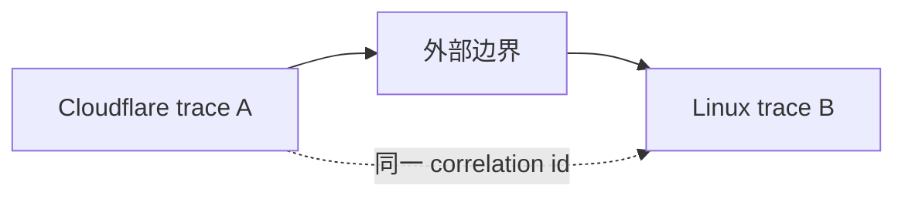
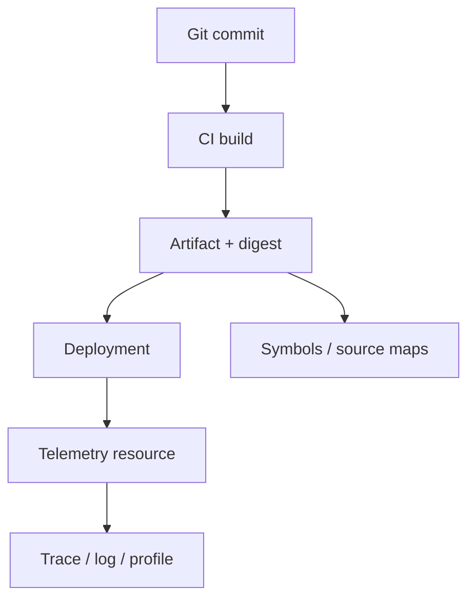
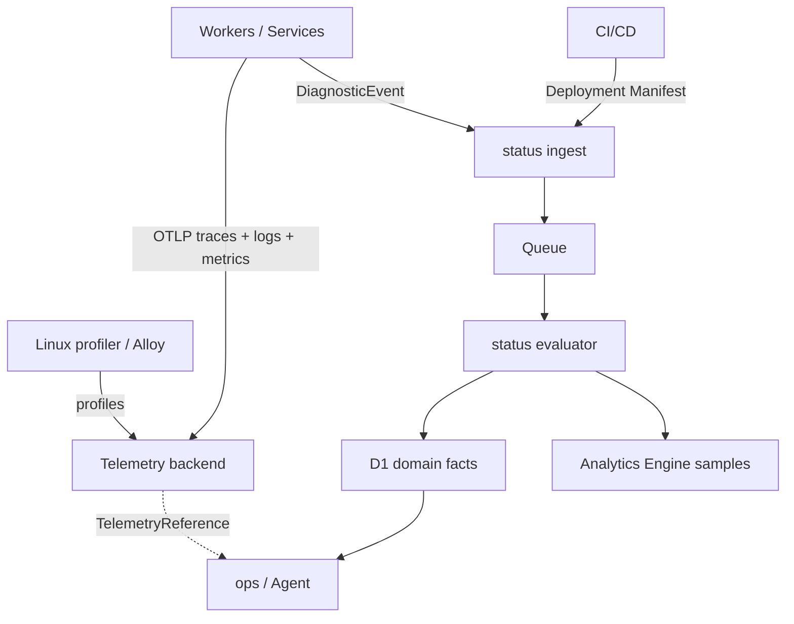

# moeSegFault 可观测性标准

## 1. 文档地位

本文定义 moeSegFault 平台的可观测性（Observability）契约。它约束所有服务、运行时、部署流水线、采集器、遥测后端、`status` 与 `ops`。实现不符合本文的必需条款时，不得声明已经接入平台可观测性。

本文使用“必须”“不得”“可以”表达规范强度，其语义遵循 BCP 14：前两者是合规要求，“可以”只表示不影响互操作性的明确可选能力。HTTP 接口的机器可读契约必须使用 OpenAPI 3.1.1；OpenAPI 文件是 HTTP 结构、类型、状态码和认证要求的唯一事实来源，本文负责说明跨接口语义与系统不变量。

## 2. 目标与边界

平台必须能够回答下列问题：

1. 发生了什么；
2. 发生在哪个服务、实例、环境和区域；
3. 属于哪次请求、任务或异步工作；
4. 来自哪次部署、哪个构建产物和哪个源代码提交；
5. 哪些 trace、log、event、metric、profile 与 probe 构成证据；
6. 这些证据如何形成 Issue、Incident 与对外状态；
7. 操作者或 Agent 如何稳定地查询并复现上述关联。

可观测性平面分为两个职责域：

- 遥测数据平面（Telemetry Data Plane）保存和查询高频原始信号；
- 运维语义平面（Operations Semantic Plane）保存服务目录、部署来源、状态机、Issue、Incident 与遥测引用。

`status` 属于运维语义平面。它不得充当 trace、log、metric 或 profile 的原始数据仓库。

## 3. 信号模型

平台采用五类相互关联但不可混同的信号。

| 信号 | 回答的问题 | 权威承载 | 是否进入 `status` 原始存储 |
| --- | --- | --- | --- |
| Trace | 一次执行经过了哪些边界、各段耗时和结果如何 | OpenTelemetry trace 后端 | 否，只保存引用 |
| Log / Event | 某一时刻记录或发生了什么 | OpenTelemetry log 后端 | 否，只保存引用或摘要 |
| Metric | 某个数值随时间如何变化 | 指标后端或 Analytics Engine | 否，只保存评估结果 |
| Profile | CPU、内存及运行时资源消耗在哪里 | Continuous Profiling 后端 | 否，只保存引用 |
| Diagnostic | 服务或评估器认为现象具有什么运维含义 | `status` | 是 |

`error` 不是独立信号。异常和失败必须表示为带标准错误语义的 Span 或 LogRecord；当失败具有服务健康含义时，生产者或评估器再产生 `DiagnosticEvent`。

## 4. 全局身份模型

每条遥测必须同时建立资源身份、部署身份与执行身份。缺失身份的遥测只能用于局部调试，不得进入跨服务诊断主链路。

### 4.1 资源身份

所有服务必须设置下列 OpenTelemetry Resource 属性。

| 属性 | 必需性 | 约束 |
| --- | --- | --- |
| `service.namespace` | 必须 | 固定为 `moeSegFault` |
| `service.name` | 必须 | 平台服务目录中的稳定逻辑名；小写 kebab-case；不得包含环境、区域、版本或实例 |
| `service.version` | 必须 | 可发布版本；没有独立发布版本时使用完整 Git commit OID |
| `service.instance.id` | 运行时暴露稳定实例边界时必须 | 同一 namespace/name 下全局唯一；进程或容器实例变化时必须变化 |
| `deployment.environment.name` | 必须 | 取 `development`、`test`、`staging`、`production` |
| `cloud.provider` | 云运行时必须 | 使用 OpenTelemetry 约定值 |
| `cloud.region` | 可确定时必须 | 使用平台原生区域标识 |
| `host.id` / `container.id` / `process.pid` | 对应实体存在且可安全暴露时必须 | 不得以低基数伪标识代替真实实例 |

OpenTelemetry 的 `deployment.id` 仍处于 Development 状态，因此平台内部稳定身份使用：

| 自定义属性 | 类型 | 语义 |
| --- | --- | --- |
| `moesegfault.deployment.id` | string | `status` Deployment Registry 中的不可变部署 ID |
| `moesegfault.build.revision` | string | 完整 Git commit OID |
| `moesegfault.artifact.digest` | string | 实际运行产物的 `sha256:<hex>` 摘要 |

实现可以同时镜像 `deployment.id`，但不得把它作为平台数据库的唯一关联键。

Cloudflare Workers 不暴露可被应用可靠识别的长期 isolate 身份，因此不得伪造 `service.instance.id`。Workers 必须使用平台提供的 `faas.invocation_id` 表示单次调用，并保留 `faas.version`、`faas.invoked_region`、`cloudflare.colo` 与 script version 等平台来源属性。跨运行时主关联键仍是 service、deployment、Correlation ID 和 trace context。

### 4.2 执行身份

#### 4.2.1 Trace Context

所有支持自主管理 OpenTelemetry 上下文的 HTTP、RPC 和消息边界必须传播 W3C Trace Context：

```http
traceparent: 00-<trace-id>-<parent-span-id>-<trace-flags>
tracestate: <vendor-state>
```

生产者必须验证入站 `traceparent`。格式非法时必须创建新的 trace，不得转发非法值。`tracestate` 必须遵循 W3C 顺序和大小限制，不得存放密钥、凭据、个人信息或业务载荷。

消息系统必须把 Trace Context 写入消息属性；消费者必须创建 consumer span，并使用消息中的上下文建立父子关系或 Span Link。重试不得复用旧 consumer span。

#### 4.2.2 平台关联 ID

Cloudflare Workers 当前不能把其平台 trace ID 自动传播到 Cloudflare 外部服务。平台因此定义独立但不替代 trace 的执行关联标识：

| 位置 | 名称 | 格式 |
| --- | --- | --- |
| HTTP header | `x-moesegfault-correlation-id` | RFC 9562 UUIDv7，小写规范文本形式 |
| OTel attribute | `moesegfault.correlation.id` | 与 header 完全相同 |
| JSON field | `correlation_id` | 与 header 完全相同 |

规则如下：

1. 公网入口必须生成新的 Correlation ID；不得信任用户提交的同名 header。
2. 已认证的平台内部调用必须原样传播现有 Correlation ID；缺失时由调用方生成。
3. 服务必须把 Correlation ID 写入当前 Span、关联 LogRecord、DiagnosticEvent 和异步消息。
4. HTTP 响应必须返回 `x-moesegfault-correlation-id`，用于用户报告与客户端诊断。
5. Correlation ID 只表示同一逻辑执行链，不表达父子结构、采样决定或安全主体。
6. Correlation ID 不得作为授权依据，也不得包含用户、租户或资源信息。

一个逻辑执行可以因为平台边界形成多个 trace，但必须只有一个 Correlation ID：



### 4.3 操作与实体身份

下列 ID 必须使用 UUIDv7，并作为不透明字符串处理：

- `diagnostic_event_id`；
- `issue_id`；
- `incident_id`；
- `maintenance_id`；
- `deployment_id`；
- `telemetry_reference_id`。

服务名、Git commit、artifact digest、trace ID 和 Correlation ID 都不得被替代为数据库自增主键。内部数据库可以使用整数代理键，但 API 不得暴露它。

## 5. Deployment Provenance Registry

Deployment Registry 是构建、部署、运行时遥测和源码之间的权威连接层。



每次部署必须在接收生产流量前注册 Deployment Manifest。Manifest 至少包含：

| 字段 | 类型 | 必需 | 约束 |
| --- | --- | --- | --- |
| `deployment_id` | UUIDv7 | 是 | 全局唯一、不可重用 |
| `service_name` | string | 是 | 必须已存在于 Service Registry |
| `environment` | enum | 是 | 与 Resource 属性一致 |
| `service_version` | string | 是 | 与运行时 Resource 一致 |
| `repository_url` | URI | 是 | 规范仓库地址 |
| `git_commit` | string | 是 | 完整 commit OID，不得使用分支名代替 |
| `git_ref` | string | 是 | 构建时 ref，仅用于显示 |
| `artifact_digest` | string | 是 | `sha256:<hex>` |
| `ci_provider` | string | 是 | 例如 `github-actions` |
| `ci_run_id` | string | 是 | 可构造永久链接的运行 ID |
| `deployed_at` | RFC 3339 date-time | 是 | UTC |
| `region` | string array | 是 | 实际部署区域；边缘全局部署使用平台约定值 |
| `artifacts` | array | 否 | 调试符号、source map、manifest、SBOM 等 |

部署注册是幂等的。同一 `deployment_id` 与相同内容重复提交必须成功；同一 ID 对应不同内容必须返回冲突。已注册 Manifest 不得原地改写；部署状态变化必须形成新的状态记录。

### 5.1 调试产物

原生二进制必须产生并保存：

- ELF Build ID 或对应平台的稳定 Build ID；
- 与发布二进制完全匹配的 debug symbols；
- Build ID 到 artifact digest、Git commit 和源路径的映射。

JavaScript/TypeScript 必须保存与部署 bundle 完全匹配的 source map。压缩或混淆后的文件名、source map 与 deployment ID 必须形成一对一可验证关联。

调试产物存入 R2 的不可变对象键；D1 只保存对象键、媒体类型、大小、摘要、Build ID 和所属 deployment。任何符号化（Symbolization）结果都必须能够反查原始 Build ID 与 artifact digest。

源码链接必须固定到 commit OID：

```text
https://github.com/<owner>/<repository>/blob/<git-commit>/<path>#L<line>
```

不得使用 `main`、tag 或可变分支生成事故证据链接。

## 6. Trace 标准

### 6.1 Span 边界

必须创建 Span 的操作：

- 公网 HTTP 请求；
- 服务间 HTTP/RPC 调用；
- D1、PostgreSQL、SQLite、KV、R2 等外部持久化操作；
- Queue publish、receive、process；
- 可独立失败或显著影响延迟的领域操作；
- 计划任务和后台任务的一次执行；
- 外部 API 调用。

不得为普通局部函数、循环迭代或无独立诊断价值的 getter 创建 Span。

Span 名称必须描述稳定操作，不得包含用户 ID、资源 ID、完整 URL、SQL 字面量或其他高基数值。变量信息必须放入 attributes。

### 6.2 状态与错误

Span 是否失败由操作语义决定，不得把所有 HTTP 4xx 一律标记为服务错误。失败必须设置标准 `error.type`；异常必须使用 `exception.type`、`exception.message`、`exception.stacktrace`。与源码位置有关时使用稳定的 `code.file.path`、`code.function.name`、`code.line.number` 与 `code.column.number`。

异常消息和 stacktrace 在进入 exporter 前必须经过敏感信息清理。

### 6.3 采样

应用必须创建完整的本地上下文并传播采样决定。导出策略必须满足：

- 错误 trace 全量保留；
- 超过服务延迟阈值的 trace 全量保留；
- 与开放 Incident 明确关联的 trace 全量保留；
- 其余 trace 按 trace ID 做确定性比例采样；
- 采样规则变更必须带 policy revision，并记录到 Deployment Registry。

不得按用户身份、请求 URI 原文或其他敏感值进行采样。采样不能改变业务行为。

## 7. Log 与 Event 标准

应用日志和结构化事件必须映射为 OpenTelemetry LogRecord。请求处理中的 LogRecord 必须从当前执行上下文自动取得 `TraceId`、`SpanId` 和 `TraceFlags`。

每条 LogRecord 必须包含：

- `Timestamp`；
- `ObservedTimestamp`；
- `SeverityNumber` 与 `SeverityText`；
- `Resource`；
- `InstrumentationScope`；
- 稳定的 `EventName`；
- `moesegfault.correlation.id`，若存在逻辑执行链；
- 结构化 attributes。

`Body` 用于人类可读摘要，不得成为机器查询所依赖的唯一字段。禁止依赖正则表达式从自由文本恢复 service、deployment、error type、resource ID 或事件类别。

### 7.1 EventName 命名

事件名使用小写点分层级：

```text
<domain>.<entity>.<past-tense-action>
```

示例：

```text
auth.login.failed
deployment.rollout.completed
dependency.connection.exhausted
status.incident.acknowledged
```

事件名必须描述已发生事实，不得使用句子、严重级别或动态值。

### 7.2 严重级别

| 等级 | 语义 |
| --- | --- |
| TRACE | 仅用于极细粒度诊断，默认不导出 |
| DEBUG | 开发和定向排障信息 |
| INFO | 正常但有审计或运维价值的状态变化 |
| WARN | 已偏离期望但请求或服务仍能完成职责 |
| ERROR | 当前操作失败，需要错误证据 |
| FATAL | 进程、实例或关键运行时即将终止或已不可恢复 |

严重级别不得代替 `error.type`、Diagnostic severity 或 Incident impact。

## 8. Metric 标准

指标必须使用 OpenTelemetry Metrics 语义与 UCUM 单位。名称必须描述测量量，不得编码单位、环境或服务名。

必须使用：

- Counter 表示单调累计事件数；
- Histogram 表示请求时延、载荷大小和其他分布；
- UpDownCounter 表示可增可减的并发量、队列长度或资源数；
- Gauge 表示在采样时刻有意义的瞬时值。

用户 ID、Correlation ID、Trace ID、完整 URL、异常消息、SQL、文件路径和任意自由文本不得成为 metric label。高基数实例属性留在 Resource 或 trace/log 中。

服务健康不得直接由单个瞬时 metric 决定。`status` 的评估器必须使用带 revision 的窗口、阈值和迟滞（Hysteresis）策略，把原始观测转换为 Diagnostic 或状态迁移。

## 9. Continuous Profiling 标准

可获得进程或宿主权限的长期运行服务必须启用持续剖析（Continuous Profiling）。采集必须是采样式、生产可持续并具有有界开销。

| 运行环境 | Trace | Log/Event | Metric | CPU Profile | 其他 Profile |
| --- | --- | --- | --- | --- | --- |
| Cloudflare Workers | 必须 | 必须 | 必须 | 不可提供 | 不可提供 |
| Linux service/container | 必须 | 必须 | 必须 | 必须 | 运行时支持时必须 |
| CLI/短任务 | 必须记录根操作 | 必须 | 有持续运行或批处理统计时必须 | 仅基准或诊断执行 | 不要求 |

Workers 不得伪造 CPU profile。统一的是身份和查询模型，不是运行时能力。

Profile 必须携带 Resource Identity、deployment ID、artifact digest、采样时间范围、profile type 和采样单位。支持 Span Profiles 的运行时必须写入 trace/span 关联；不支持时必须通过 service、deployment、instance 与 time range 关联。

原生语言 profile 必须以 Build ID 完成符号化。无法证明符号文件与 artifact digest 匹配时，结果必须标记为未验证，不得生成源码永久链接。

由于 OpenTelemetry Profiles 仍为 Alpha，Profiles 的传输和后端 schema 不得成为 `status` 的领域模型。`status` 只保存后端无关的 `TelemetryReference`。

## 10. Diagnostic 标准

Diagnostic 表达“观测意味着什么”，而不是重复原始 telemetry。

合法 Diagnostic 必须满足：

- 有稳定 `event_id`，可在至少一次投递中去重；
- 指向一个已注册 service 和 deployment；
- 包含明确 `kind`、`severity`、`observed_at` 与 `summary`；
- 包含至少一个 evidence 或可重建 evidence 的 execution identity；
- fingerprint 输入由稳定分类字段组成，不包含时间戳、随机 ID 或自由文本；
- 不携带完整 profile、批量日志或 trace payload。

用户级失败、正常拒绝、预期重试和已处理异常不得自动升级为 Diagnostic。只有影响服务能力、依赖可用性、数据正确性、安全性或运维动作的事实才进入 `status`。

## 11. TelemetryReference

跨信号关联统一使用后端无关的 `TelemetryReference`：

| 字段 | 类型 | 必需 | 说明 |
| --- | --- | --- | --- |
| `id` | UUIDv7 | 是 | 引用身份 |
| `kind` | enum | 是 | `trace`、`log_query`、`profile`、`metric_query`、`source`、`artifact` |
| `backend` | string | 是 | 后端注册名，不是展示 URL |
| `locator` | object | 是 | kind-specific 结构化定位器 |
| `time_range` | object | 条件必需 | 查询型引用必须包含 UTC `start`、`end` |
| `service_name` | string | 是 | 稳定服务名 |
| `deployment_id` | UUIDv7 | 是 | 来源部署 |
| `correlation_id` | UUIDv7 | 否 | 逻辑执行关联 |
| `trace_id` | 32 hex | 否 | W3C trace ID |
| `span_id` | 16 hex | 否 | W3C span ID |
| `expires_at` | date-time | 否 | 后端数据可能过期时声明 |

`locator` 必须保存结构化查询参数，不得只保存供应商 UI URL。`ops` 根据 backend registry 构造可点击 URL；Agent 使用同一 locator 通过查询适配器获取数据。

## 12. 传输与拓扑



服务必须优先通过 OTLP 导出 traces、logs 和 metrics。Linux 环境通过 OpenTelemetry Collector 或 Grafana Alloy 聚合和批量发送；Workers 使用平台原生 tracing/logging 与 OTLP export。

业务请求不得同步等待遥测后端。Exporter 必须有有界队列、批量、超时和退避；队列满时按 DEBUG/TRACE、INFO、WARN 的顺序丢弃，ERROR/FATAL 只在资源安全受到威胁时丢弃。丢弃数量必须由本地 self-observability counter 暴露。

Diagnostic ingest 只需等待认证、schema 校验和 Queue 接受，成功返回 `202 Accepted`。它不得等待聚合、D1 写入或 Incident 计算。

## 13. 时间、顺序与幂等

所有外部 JSON 时间使用 RFC 3339 UTC，序列化为带 `Z` 的字符串。内部遥测保留来源时间与观察时间：

- `occurred_at`：生产者时钟认为事件发生的时间；
- `observed_at`：平台首次观察到事件的时间；
- `received_at`：`status` 接收时间。

平台不得假设跨主机时钟严格同步。排序以领域序列号或数据库提交顺序为准，时间只用于查询和近似因果判断。

所有可能重试的写请求必须具备稳定幂等键。Queue 采用至少一次投递语义，消费者必须在同一 D1 事务中完成去重记录与领域变更。

## 14. 安全、隐私与基数控制

以下内容不得进入 telemetry：

- 密码、API key、cookie、authorization header、Access token；
- 完整请求或响应正文，除非字段经过显式 allowlist；
- 数据库连接串和带凭据 URI；
- 用户隐私字段、私信内容、上传文件内容；
- 未经清理的 exception message、SQL 或命令行。

清理必须在生产者或 Collector exporter 之前完成。后端查询权限不能代替源头清理。

Attributes 分为：

- 可聚合低基数字段：service、environment、operation、status、error.type；
- 仅检索高基数字段：trace ID、Correlation ID、deployment ID、resource ID；
- 禁止字段：密钥、正文、无限增长自由文本。

Metric label 只能使用第一类。Trace/Log 可以使用第二类。任何自定义属性必须登记 owner、类型、语义、基数级别和保密级别。

## 15. 自可观测性与递归边界

Collector、exporter、`status` 与 `ops-gateway` 必须暴露自身队列深度、导出失败、丢弃数量、处理延迟和最后成功时间。

`status` 自身的 traces/logs/metrics 必须直接进入遥测后端，不得把每个内部错误重新提交到自己的 Diagnostic Queue。只有外部可验证的 health probe 或人工操作才能把 `status` 的故障形成平台 Incident，避免递归事故风暴。

`ops` 无法访问 `status` 或看到状态数据超过 freshness deadline 时，必须显示“监控系统不可用”，不得把它解释为“所有服务正常”。

## 16. OpenAPI 契约规则

所有平台 HTTP API 必须满足：

1. 使用 OpenAPI 3.1.1 与 JSON Schema 2020-12；
2. 路径使用复数名词和 `/v1` major-version 前缀；
3. JSON 字段使用 `snake_case`；
4. 时间使用 `format: date-time`，UUID 使用 `format: uuid`；
5. 枚举值使用小写 `snake_case`；
6. 错误使用 RFC 9457 `application/problem+json`；
7. 所有 operation 必须声明唯一 `operationId`、security、成功响应、错误响应和幂等语义；
8. 写操作必须声明最大 body、未知字段策略和重放行为；
9. 列表使用不透明 cursor 分页，不得使用数据库 offset 作为外部契约；
10. 所有响应必须返回 `x-moesegfault-correlation-id`；
11. OpenAPI schema 与运行时校验必须由同一类型来源生成或在 CI 中做双向一致性验证；
12. 未在 OpenAPI 中声明的公网路由不得部署。

兼容性规则：

- 可以增加可选字段、新 endpoint 和新的 Problem Details type；
- 不得删除字段、收紧已有输入约束、改变字段语义或复用枚举值；
- 客户端必须忽略未知响应字段；
- 服务端必须拒绝未知写入字段，除非 schema 明确声明扩展对象；
- 破坏性变更必须进入新的 path major version；旧 major 在明确迁移与退役完成前保持行为兼容。

## 17. 合规门禁

服务只有在以下检查全部通过后才可进入 production：

| 检查 | 通过条件 |
| --- | --- |
| Resource Identity | 必需字段齐全且与 Deployment Registry 匹配 |
| Context Propagation | HTTP/RPC/Queue 集成测试验证 trace 与 Correlation ID 传播 |
| Structured Logs | ERROR 样例可按 service、deployment、error.type、trace 检索 |
| Redaction | 密钥与隐私 canary 不出现在导出 payload |
| Metrics Cardinality | CI/预发布负载下序列数量有界 |
| Profiling | 支持的 Linux 服务可按 deployment 符号化到函数；Workers 明确标记 unsupported |
| Diagnostic Idempotency | 同一事件重复投递不产生重复 occurrence 或 transition |
| Provenance | trace/log/profile 可反查 commit 与 artifact digest |
| Failure Isolation | 遥测后端不可用不阻塞业务请求 |
| Contract | OpenAPI lint、schema 测试与 breaking-change 检查通过 |

## 18. 规范依据

- [OpenAPI Specification 3.1.1](https://spec.openapis.org/oas/v3.1.1.html)
- [RFC 9457: Problem Details for HTTP APIs](https://www.rfc-editor.org/rfc/rfc9457.html)
- [RFC 9562: UUIDs](https://www.rfc-editor.org/rfc/rfc9562.html)
- [RFC 3339: Date and Time on the Internet](https://www.rfc-editor.org/rfc/rfc3339.html)
- [W3C Trace Context](https://www.w3.org/TR/trace-context/)
- [OpenTelemetry Specification](https://opentelemetry.io/docs/specs/otel/)
- [OpenTelemetry Resource Semantic Conventions](https://opentelemetry.io/docs/specs/semconv/resource/)
- [OpenTelemetry Logs Data Model](https://opentelemetry.io/docs/specs/otel/logs/data-model/)
- [OpenTelemetry Code Attributes](https://opentelemetry.io/docs/specs/semconv/registry/attributes/code/)
- [OpenTelemetry Exception Attributes](https://opentelemetry.io/docs/specs/semconv/registry/attributes/exception/)
- [OpenTelemetry Profiles](https://opentelemetry.io/docs/specs/otel/profiles/)
- [Cloudflare Workers Tracing Known Limitations](https://developers.cloudflare.com/workers/observability/traces/known-limitations/)
- [Cloudflare Workers OpenTelemetry Export](https://developers.cloudflare.com/workers/observability/exporting-opentelemetry-data/)
- [Cloudflare Queues Delivery Guarantees](https://developers.cloudflare.com/queues/reference/delivery-guarantees/)
- [Grafana Pyroscope Span Profiles](https://grafana.com/docs/pyroscope/latest/configure-client/trace-span-profiles/)
