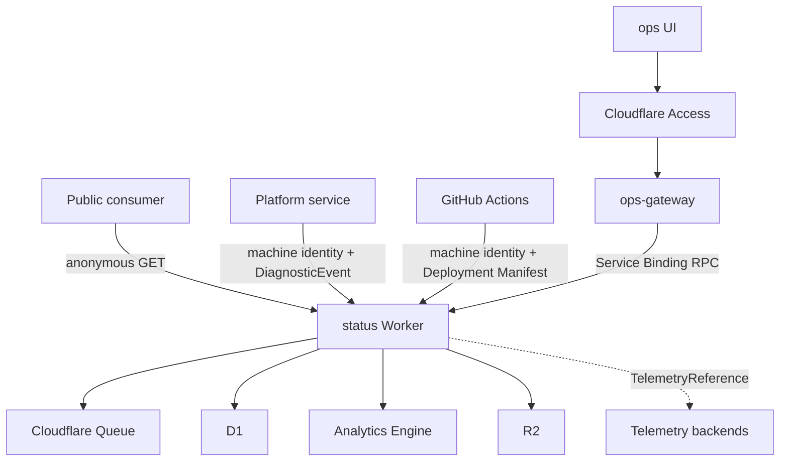
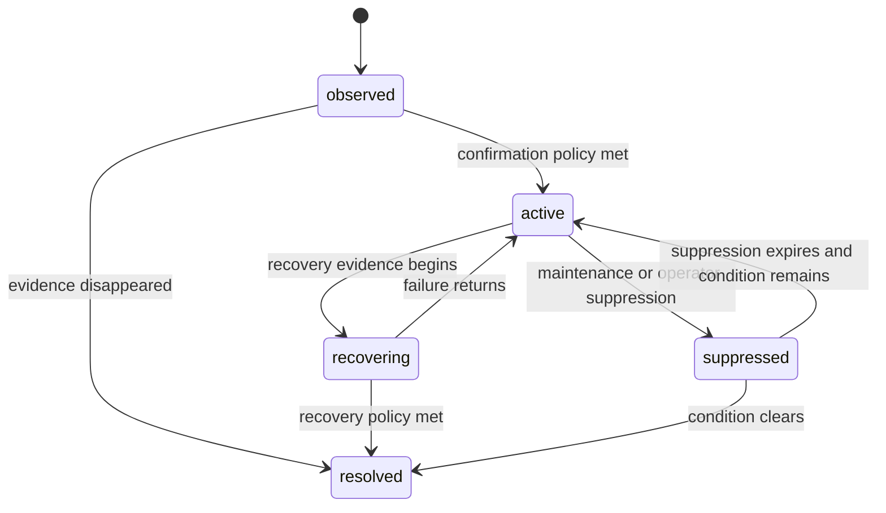
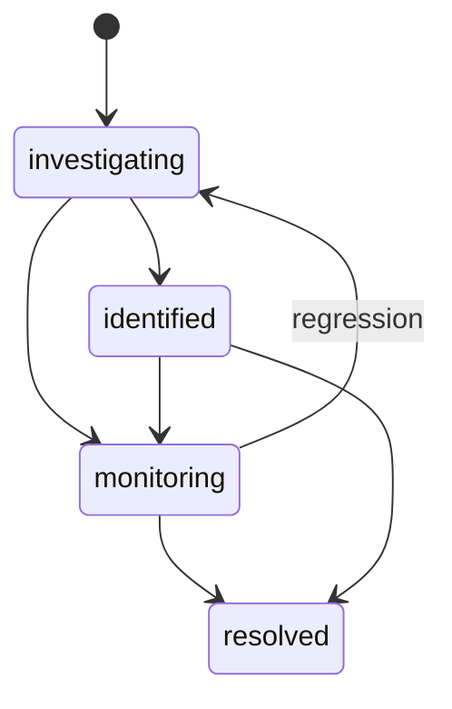
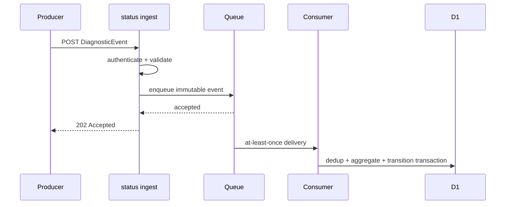
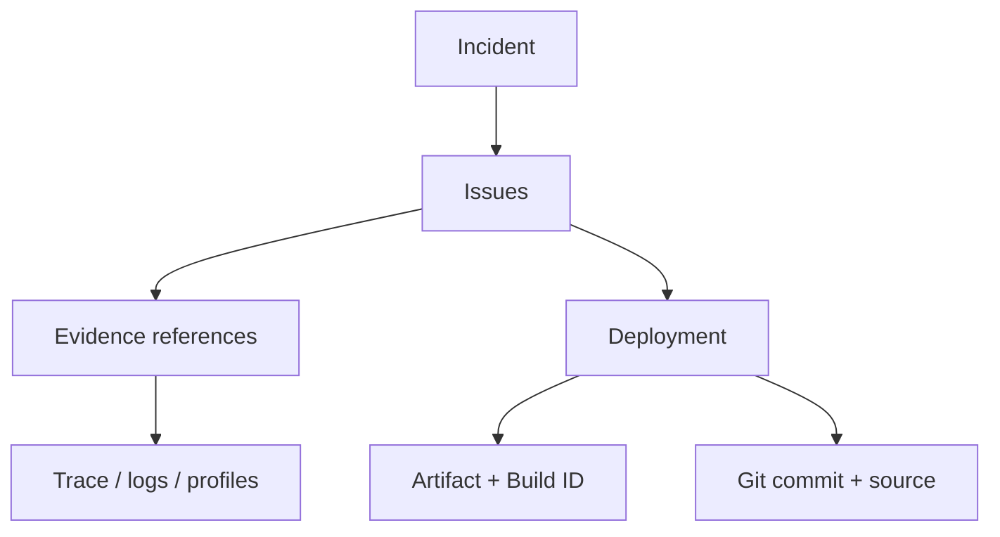

# moeSegFault Status 服务设计

## 1. 定位

`status.moesegfault.dev` 是 moeSegFault 平台的运维领域服务（Operations Domain Service）。它把 health probe、DiagnosticEvent、部署来源和人工判断转换为可查询、可审计的服务状态、Issue、Incident 与证据图。

它负责：

- 服务、组件和依赖目录；
- 主动 health probe；
- DiagnosticEvent 接收、去重、聚合与评估；
- 当前服务状态与状态迁移历史；
- Issue 与 Incident 生命周期；
- Maintenance Window；
- Deployment Provenance Registry；
- TelemetryReference 与诊断证据关联；
- 面向公众的状态查询；
- 面向 `ops` 和 Agent 的受控运维操作。

它不负责：

- 保存原始 traces、logs、metrics 或 profiles；
- 管理人类账号、密码或登录会话；
- 代替 Cloudflare Access 认证管理员；
- 代替 Grafana/Tempo/Loki/Pyroscope 等遥测查询后端；
- 从下游故障机械地推导上游服务也“故障”；
- 宣称自己能够独立证明自身可用。

## 2. 系统上下文



部署形态固定为：

- `status` 运行在 Cloudflare Workers；
- D1 保存权威领域状态；
- Cloudflare Queue 隔离诊断接收与聚合；
- Analytics Engine 保存高频 probe 与评估样本；
- R2 保存 deployment manifest、debug symbols、source maps 和其他不可变产物；
- Grafana Cloud 或等价 OpenTelemetry 后端保存 traces、logs、metrics 与 profiles；
- `ops.moesegfault.dev` 是 GitHub Pages 上的无状态前端；
- `ops-gateway` 承接 Access 身份、同源 `/api/*` 和到 `status` 的 Service Binding RPC。

Durable Objects、PostgreSQL、Kafka 和自建 ClickHouse 不属于该服务架构。D1 的单写者模型与当前领域事务边界一致；实体级实时协调不存在，不引入额外 actor 层。

## 3. 设计不变量

1. D1 保存“系统当前相信什么以及为何相信”，不保存 telemetry 洪水。
2. 每一次状态变化必须能追溯到 Observation、DiagnosticEvent、人工操作或 Maintenance Window。
3. 每一条证据必须能追溯到 service、deployment 与 source provenance。
4. Issue 是机器聚合的可操作条件；Incident 是面向影响、协作和沟通的运维事件。二者不得混为一表。
5. 状态是领域评估结果，不等于最近一次 HTTP 状态码。
6. 依赖影响是独立视图，不得覆盖服务自身状态。
7. 公网写入与管理员写入使用不同信任域。
8. Queue 至少一次投递不得产生重复 occurrence、重复 transition 或重复 Incident update。
9. `status` 不可用时，`ops` 必须显示监控不可用，不得显示全绿。
10. 所有领域写入必须留下不可变审计记录。

## 4. 领域模型

### 4.1 Service 与 Component

`Service` 是具有独立部署和运维责任的逻辑能力，`service_name` 与 OpenTelemetry `service.name` 完全一致。

`Component` 是服务对外呈现的状态单元，例如 `login`、`token-refresh`、`public-api`。Component 可以由一个或多个 Service 支撑，但不得等同于实例、容器或单个 endpoint。

| 实体 | 关键字段 |
| --- | --- |
| Service | `service_name`、`display_name`、`description`、`owner`、`criticality`、`enabled` |
| Component | `component_id`、`service_name`、`display_name`、`public`、`sort_order` |
| Dependency | `source_service`、`target_service`、`kind`、`criticality`、`capability` |

依赖图必须是有向图。循环依赖可以存在，但影响计算必须使用 visited set，禁止递归展开造成无限传播。

### 4.2 Monitor、Probe 与 Observation

`Monitor` 定义如何主动验证一个 capability。每个 Monitor 指向一个 Service 或 Component，并引用不可变的 Evaluation Policy revision。

| 字段 | 语义 |
| --- | --- |
| `monitor_id` | UUIDv7 |
| `target_type` | `service` 或 `component` |
| `target_id` | 目标身份 |
| `probe_kind` | `http`、`tcp`、`dns`、`rpc`、`synthetic` |
| `schedule` | Cron 表达式或固定 interval |
| `timeout_ms` | 单次 probe deadline |
| `locations` | 执行位置集合 |
| `policy_revision` | 评估规则不可变 revision |
| `enabled` | 是否调度 |

`Observation` 是一次原始 probe 结果：

```text
Observation {
  observation_id
  monitor_id
  observed_at
  location
  outcome: success | failure | timeout | invalid
  latency_ms
  protocol_status
  error_type
  correlation_id
}
```

所有 Observation 写入 Analytics Engine。D1 只保存每个 monitor/location 的当前评估检查点：最后观察时间、连续成功/失败计数、窗口统计、当前评估结果与 policy revision；状态迁移另行追加。

### 4.3 Evaluation Policy

Evaluation Policy 是不可变、带 revision 的规则对象，包含：

- observation window；
- 最小样本数；
- failure threshold；
- recovery threshold；
- latency threshold；
- stale deadline；
- 多位置 quorum；
- Issue fingerprint template；
- 状态映射。

修改策略必须创建新 revision。每次评估结果和状态迁移必须记录所用 revision，保证历史可以重放。

评估使用迟滞（Hysteresis）：进入故障和恢复正常使用不同阈值。`unknown` 表示观测不足、过期或监控系统无法判断，不得等同于 `operational`。

### 4.4 DiagnosticEvent

`DiagnosticEvent` 是服务或平台评估器提交的运维语义事实。

```json
{
  "event_id": "0199d0a8-2e12-7a59-a51e-44aa9b6d1001",
  "schema_version": "1.0",
  "kind": "dependency.unavailable",
  "severity": "error",
  "service_name": "identity",
  "deployment_id": "0199d09a-b692-7ce0-a1c0-5138a43d7402",
  "instance_id": "627cc493-f310-47de-96bd-71410b7dec09",
  "occurred_at": "2026-09-08T15:51:02.314Z",
  "correlation_id": "0199d0a7-d771-7435-a388-bb6fa5d533fc",
  "trace_id": "4bf92f3577b34da6a3ce929d0e0e4736",
  "span_id": "00f067aa0ba902b7",
  "summary": "D1 query exceeded the dependency deadline",
  "fingerprint": {
    "dependency": "d1",
    "operation": "identity.lookup",
    "error_type": "timeout"
  },
  "evidence": [
    {
      "kind": "trace",
      "backend": "grafana-cloud",
      "locator": {
        "trace_id": "4bf92f3577b34da6a3ce929d0e0e4736"
      }
    }
  ],
  "attributes": {
    "dependency.name": "d1",
    "error.type": "TimeoutError"
  }
}
```

`summary` 只用于展示。聚合必须使用规范化 `kind + service_name + fingerprint`，不得解析 summary。

### 4.5 Issue

Issue 是相同 Diagnostic 条件经过聚合后形成的机器事实。

```text
Issue {
  issue_id
  fingerprint_hash
  service_name
  kind
  severity
  state
  first_seen_at
  last_seen_at
  occurrence_count
  affected_instances
  policy_revision
  latest_evidence[]
  revision
}
```

Issue 状态机：



`observed` 不影响公开状态；`active` 和 `recovering` 参与状态计算；`suppressed` 保留证据但不生成公开影响；`resolved` 不可重新打开，同 fingerprint 再次发生时创建新的 Issue，并通过 recurrence 关联。

### 4.6 Incident

Incident 是一组相关 Issue 及人工判断形成的运维协作对象。一个 Issue 可以不进入 Incident；一个 Incident 可以关联多个 Service 和 Issue。

Incident 状态机：



Incident 字段：

| 字段 | 说明 |
| --- | --- |
| `incident_id` | UUIDv7 |
| `title` | 面向人类的稳定标题 |
| `state` | `investigating`、`identified`、`monitoring`、`resolved` |
| `impact` | `degraded`、`partial_outage`、`major_outage` |
| `started_at` | 实际影响开始时间 |
| `detected_at` | 平台识别时间 |
| `resolved_at` | 完全恢复时间 |
| `affected_components` | 对外影响范围 |
| `issue_ids` | 证据来源 |
| `cause` | 已确认原因；未确认时为空 |
| `revision` | 乐观并发版本 |

每次状态、impact、title、cause、affected components 或关联 Issue 变化，都必须追加 `IncidentUpdate`。Update 不可修改或删除；更正通过新的 update 表达。

### 4.7 Maintenance Window

Maintenance Window 表示预先批准的服务影响区间，字段包括目标、开始/结束时间、预期 impact、说明、创建者和 revision。

Maintenance 不会伪造 probe 成功。它只改变 Issue 的 suppression 和公开展示。窗口结束后，评估器必须基于最新 evidence 立即重新计算状态。

### 4.8 Deployment 与 TelemetryReference

Deployment 与 TelemetryReference 遵循《moeSegFault 可观测性标准》。`status` 保存它们的结构化字段，不保存供应商 UI URL 作为唯一 locator。

## 5. 状态模型

Service/Component 状态枚举固定为：

| 状态 | 语义 |
| --- | --- |
| `operational` | 有足够且新鲜的证据证明能力正常 |
| `degraded` | 能力仍可用，但延迟、错误率或部分功能偏离契约 |
| `partial_outage` | 部分请求、区域、实例或子能力不可用 |
| `major_outage` | 核心能力整体不可用或数据正确性无法保证 |
| `maintenance` | 当前影响被已生效 Maintenance Window 覆盖 |
| `unknown` | 证据缺失、过期、冲突或监控系统不可用 |

对未被 Maintenance 抑制的直接 Issue，故障状态按以下严重度聚合：

```text
major_outage > partial_outage > degraded > operational
```

`maintenance` 与 `unknown` 不参与严重度排序。目标存在生效 Maintenance 且没有未抑制直接 Issue 时，状态为 `maintenance`；Maintenance 期间仍存在未被窗口覆盖的直接 Issue 时，按实际故障状态展示，并附带 Maintenance 元数据。关键 monitor 为 unknown 且没有更强的直接故障证据时，聚合状态为 `unknown`。

状态计算输入只能是：

- active/recovering Issue；
- 生效的 Maintenance Window；
- 关键 monitor 的 freshness；
- 操作者明确覆盖，且覆盖有到期时间与审计记录。

### 5.1 依赖影响

依赖故障不得直接改写调用方 Service 的自身状态。系统分别计算：

- `direct_status`：由服务自身 evidence 得出；
- `dependency_risk`：由依赖图和依赖状态计算；
- `effective_impact`：面向用户 capability 的综合影响。

这样可以区分“identity 自己坏了”和“identity 因 D1 不可用而受影响”，也避免一个底层故障制造几十个伪独立 Incident。

## 6. 数据流

### 6.1 Diagnostic ingest



Ingest 只执行：

1. 机器身份认证；
2. body 大小限制；
3. OpenAPI/JSON Schema 校验；
4. service/deployment claim 与 payload 一致性校验；
5. `received_at` 和可信 producer metadata 附加；
6. Queue enqueue。

Consumer 在单个 D1 事务中执行：

1. 插入 `diagnostic_event_dedup`；
2. 若已存在则无副作用完成；
3. 计算 fingerprint hash；
4. 创建或更新 Issue；
5. 记录 occurrence 摘要；
6. 更新 service evaluation；
7. 必要时追加 status transition；
8. 写入 outbox 供通知和缓存失效使用。

### 6.2 Health probe

Cron Trigger 读取到期 monitors，按全局并发、每目标并发与 timeout 预算执行 probe。任何 probe 不得超过下一调度周期，也不得因为单个慢目标阻塞其他目标。

每次 Observation：

- 写入 Analytics Engine；
- 更新 D1 中对应 evaluator checkpoint；
- 使用固定 policy revision 计算结果；
- 只有领域状态变化时追加 transition；
- 达到 Diagnostic 条件时走与外部 Diagnostic 相同的聚合函数。

Probe 请求必须携带独立 Correlation ID 和 user-agent；不得把 probe 产生的业务副作用视为可接受行为。Synthetic monitor 必须使用专用测试主体和可清理数据。

### 6.3 Deployment registration

GitHub Actions 构建产物并计算 digest 后：

1. `PUT /v1/deployments/{deployment_id}` 注册不可变 Manifest；
2. 创建受限 artifact upload session；
3. 直接上传 debug artifacts/source maps 到内容寻址的 R2 对象键；
4. `status` 校验 service、commit、artifact digest 和对象 metadata，并提交 artifact 记录；
5. deployment 满足所有必需 artifact 后进入 `ready`；
6. 部署系统只把流量切换到 `ready` deployment；
7. 运行时 telemetry 使用同一 deployment ID。

未成功注册的 deployment 不得接收 production 流量。

## 7. 存储设计

### 7.1 D1：权威领域状态

| 表 | 作用 | 关键约束/索引 |
| --- | --- | --- |
| `services` | 服务目录 | `service_name UNIQUE` |
| `components` | 对外状态组件 | `(service_name, component_id) UNIQUE` |
| `service_dependencies` | 有向依赖图 | `(source_service, target_service, capability) UNIQUE` |
| `monitors` | probe 定义 | `next_run_at` index |
| `evaluation_policies` | 不可变规则 revision | `(policy_id, revision) UNIQUE` |
| `monitor_checkpoints` | 当前窗口与连续计数 | `(monitor_id, location) UNIQUE` |
| `issues` | 聚合条件 | active fingerprint partial uniqueness；`service_name,state,last_seen_at` index |
| `issue_occurrences` | 有界 occurrence 摘要 | `issue_id, occurred_at` index；不存完整 payload |
| `incidents` | 运维事件当前快照 | `state, started_at` index；`revision` |
| `incident_issues` | Incident/Issue 关联 | `(incident_id, issue_id) UNIQUE` |
| `incident_updates` | 不可变时间线 | `(incident_id, sequence) UNIQUE` |
| `status_transitions` | 服务/组件状态历史 | `(target_type,target_id,occurred_at)` index |
| `maintenance_windows` | 维护窗口 | `starts_at,ends_at` index |
| `deployments` | Deployment Registry | `deployment_id UNIQUE`；`service_name,deployed_at` index |
| `deployment_artifacts` | R2 对象与摘要 | `artifact_digest,build_id` index |
| `telemetry_references` | 后端无关证据 | `issue_id`、`incident_id`、`correlation_id`、`trace_id` indexes |
| `diagnostic_event_dedup` | Queue 幂等 | `event_id PRIMARY KEY` |
| `audit_log` | 管理操作审计 | actor、action、target、occurred_at indexes |
| `outbox` | 通知与缓存失效 | `state,next_attempt_at` index |

`issue_occurrences` 必须采用有界保留：Issue 当前聚合统计永久保留，明细超过领域保留窗口后删除；原始证据仍由 telemetry backend retention 管理。Incident 中被引用的 occurrence 摘要不得在 Incident 存续期间删除。

### 7.2 Analytics Engine：高频样本

Analytics Engine 保存：

- 每次 probe 的 outcome、latency、location；
- diagnostic 到达计数；
- evaluator latency；
- queue lag；
- status API latency 与错误率。

这些样本用于趋势、阈值和容量分析，不作为 Incident 当前状态的唯一事实来源。

### 7.3 R2：不可变大对象

```text
observability/
  manifests/<deployment-id>.json
  symbols/<artifact-digest>/<build-id>.debug
  sourcemaps/<deployment-id>/<bundle>.map
  sbom/<artifact-digest>.json
```

对象键不可覆盖。相同 digest 的内容可以去重，但数据库必须保留每个 deployment 到 artifact 的关系。

### 7.4 Telemetry backend

Trace、Log、Metric 与 Profile 后端通过 backend registry 配置：

```text
TelemetryBackend {
  name
  capabilities[]
  query_adapter
  ui_url_template
  retention_class
  auth_reference
}
```

凭据只存在 Secrets/Access 受控环境，不进入 D1、OpenAPI response 或前端 bundle。

## 8. API 契约

OpenAPI 3.1.1 文件是接口事实来源。以下表定义资源面。

### 8.1 公共只读 HTTP API

| Method | Path | operationId | 语义 |
| --- | --- | --- | --- |
| GET | `/v1/status` | `getPlatformStatus` | 平台聚合状态、freshness 与当前影响 |
| GET | `/v1/services` | `listServices` | 公开服务/组件当前状态 |
| GET | `/v1/services/{service_name}` | `getServiceStatus` | 服务 direct status、dependency risk、components |
| GET | `/v1/incidents` | `listIncidents` | 当前及历史公开 Incident，cursor 分页 |
| GET | `/v1/incidents/{incident_id}` | `getIncident` | Incident 时间线与公开证据摘要 |
| GET | `/v1/maintenance-windows` | `listMaintenanceWindows` | 当前及未来维护 |

公共响应不得暴露 instance ID、内部依赖地址、stacktrace、私有 repository、R2 object key、后台 locator、操作者邮箱或未脱敏属性。

`GET /v1/status` 必须返回：

```json
{
  "data": {
    "status": "degraded",
    "evaluated_at": "2026-09-08T15:55:00.000Z",
    "fresh_until": "2026-09-08T15:57:00.000Z",
    "active_incident_count": 1,
    "components": [
      {
        "id": "login",
        "status": "degraded"
      }
    ]
  },
  "links": {
    "self": "https://status.moesegfault.dev/v1/status"
  }
}
```

缓存响应必须同时包含 `evaluated_at` 和 `fresh_until`。超过 freshness 后即使缓存仍可读取，客户端也必须显示 unknown/monitoring unavailable。

### 8.2 机器写入 HTTP API

| Method | Path | operationId | 成功语义 |
| --- | --- | --- | --- |
| POST | `/v1/diagnostic-events` | `ingestDiagnosticEvent` | `202 Accepted`；重复 event 仍为成功 |
| PUT | `/v1/deployments/{deployment_id}` | `putDeployment` | `201 Created` 或相同内容 `200 OK` |
| POST | `/v1/deployments/{deployment_id}/artifact-uploads` | `createDeploymentArtifactUpload` | 创建有时限、受限对象键的上传会话 |
| POST | `/v1/deployments/{deployment_id}/artifacts` | `createDeploymentArtifact` | 校验已上传对象摘要并登记不可变 artifact |

`DiagnosticEvent` body 上限固定为 64 KiB。完整 stacktrace、log batch、profile 或 binary artifact 必须进入对应后端/R2，再通过 TelemetryReference 关联。

机器 token 必须绑定：

- `subject`；
- 允许的 `service_name`；
- 允许的 environment；
- scopes；
- 短有效期和唯一 token ID。

Payload 中的 service 与 environment 必须和 token claims 完全一致。

### 8.3 内部管理 RPC

管理能力不暴露在 `status.moesegfault.dev` 公网 HTTP 路由。`ops-gateway` 通过 Service Binding 调用 typed RPC：

```text
getIncident(principal, incident_id)
searchIssues(principal, query)
createIncident(principal, command)
updateIncident(principal, incident_id, expected_revision, command)
acknowledgeIssue(principal, issue_id, expected_revision)
suppressIssue(principal, issue_id, expected_revision, until, reason)
createMaintenanceWindow(principal, command)
updateMaintenanceWindow(principal, id, expected_revision, command)
queryDiagnosticContext(principal, locator)
registerService(principal, command)
updateMonitor(principal, monitor_id, expected_revision, command)
```

RPC command 与 result 必须由共享 schema 包定义；运行时仍执行领域授权，不能仅依赖 Service Binding 的网络私有性。

### 8.4 响应、错误与并发

所有 HTTP 错误使用 RFC 9457：

```json
{
  "type": "https://status.moesegfault.dev/problems/deployment-conflict",
  "title": "Deployment identifier already exists with different content",
  "status": 409,
  "detail": "The supplied manifest does not match the registered digest.",
  "instance": "/v1/deployments/0199d09a-b692-7ce0-a1c0-5138a43d7402",
  "correlation_id": "0199d0a7-d771-7435-a388-bb6fa5d533fc"
}
```

可变领域资源必须返回 `ETag`，管理 mutation 必须携带 `If-Match` 或 RPC `expected_revision`。版本不匹配返回 `409 Conflict`；服务不得静默覆盖并发变更。

列表响应使用：

```json
{
  "data": [],
  "page": {
    "next_cursor": null
  },
  "links": {
    "self": "..."
  }
}
```

Cursor 是不透明、签名并带查询绑定的值；修改 filter 或 sort 后不得复用。

## 9. 身份与授权

系统存在三个独立信任域：

| 信任域 | 认证 | 可用能力 |
| --- | --- | --- |
| Public Consumer | anonymous | 仅公共 GET |
| Internal Service / CI | Service Binding、Cloudflare Service Token 或短期 JWT | 只允许 claim 绑定的 ingest/deployment 操作 |
| Human Operations | Cloudflare Access → `ops-gateway` → `AdminPrincipal` | 领域授权后的管理 RPC |

`ops-gateway` 必须验证 Access JWT 的签名、issuer、audience、expiration 与 nonce/会话要求，然后规范化：

```text
AdminPrincipal {
  subject
  email
  roles[]
  authenticated_at
  access_application
}
```

角色语义：

| 角色 | 权限 |
| --- | --- |
| `viewer` | 读取内部诊断、evidence locator 与审计记录 |
| `operator` | viewer + acknowledge/suppress Issue、创建更新 Incident、维护窗口 |
| `admin` | operator + 服务目录、monitor policy、角色与 backend registry 管理 |

每个管理操作必须在领域层检查权限，并把 principal、action、target、before revision、after revision、Correlation ID 与时间写入 audit log。

`status` 不得提供 `/admin/login`、密码表或独立浏览器 session。

## 10. 一致性与事务

D1 是领域写入的唯一权威。下列变化必须在单一事务中完成：

- Diagnostic dedup + Issue aggregate + status transition + outbox；
- Incident mutation + IncidentUpdate + audit log + outbox；
- Maintenance mutation + audit log + 受影响目标重评估标记；
- Deployment manifest + artifact references + audit record。

Analytics Engine、telemetry backend 和 R2 不参与 D1 分布式事务。系统使用不可变 ID、digest、outbox 与幂等 consumer 达成最终一致。不得引入伪两阶段提交。

公开查询读取 D1 当前快照。缓存可以延迟，但必须公开 freshness；管理查询必须读取主一致性视图。任何 read replica/session 使用都不得破坏同一管理操作后的 read-your-writes。

## 11. 失败处理与背压

| 故障 | 系统行为 |
| --- | --- |
| Queue 暂时不可用 | ingest 返回 `503` + `Retry-After`；生产者按同一 event ID 重试 |
| D1 暂时不可用 | Queue consumer retry；不 ack；幂等键保持不变 |
| Analytics Engine 不可用 | 领域状态处理继续；记录 sample drop counter |
| Telemetry backend 不可用 | 业务与 Diagnostic ingest 继续；evidence 标记暂不可查询 |
| R2 不可用 | deployment artifact commit 失败；生产流量不得切换到未注册产物 |
| Probe target 超时 | 形成 timeout Observation；不重试到超过本轮 deadline |
| `status` API 不可用 | `ops` 显示 monitoring unavailable；不得使用过期全绿状态 |
| Access 不可用 | 公共读仍可用；管理 mutation fail closed |

Queue consumer 必须设置最大尝试次数和 Dead Letter Queue。进入 DLQ 的事件必须保留原 event ID、producer identity、失败阶段和最后 Problem type；重放仍经过相同 dedup 事务。

## 12. `status` 自身的可观测性

`status` 必须遵循平台可观测性标准，并至少暴露：

- HTTP request rate、latency、error rate；
- Queue publish failure、consumer lag、retry、DLQ count；
- Diagnostic schema rejection 和 auth rejection；
- D1 query latency、transaction failure、conflict；
- probe due count、executed count、timeout、stale monitor；
- evaluation latency、transition count、Issue creation count；
- Analytics sample drop；
- outbox backlog 与 delivery failure；
- public status freshness。

这些 telemetry 直接进入外部 backend。`status` 不把自身每个异常重新发送到自己的 ingest。

`ops` 每次打开时同时验证：

1. 静态前端成功加载；
2. `ops-gateway` Access 会话有效；
3. `status` 管理 RPC 可用；
4. `/v1/status` 的 `fresh_until` 未过期。

任一失败都必须在 UI 顶部显示明确的控制面故障，而不是把数据区域留空。

## 13. Ops 与 Agent 查询模型

Incident 详情必须形成一张诊断证据图：



`queryDiagnosticContext` 返回结构化对象：

```text
DiagnosticContext {
  incident
  issues[]
  affected_services[]
  dependency_paths[]
  deployments[]
  evidence[]
  source_locations[]
  status_transitions[]
  audit_summary
}
```

Agent 不得只获得预拼接文本。它必须拿到稳定 ID、typed relation、时间范围、后端 locator、provenance 和数据 freshness，才能自主选择进一步查询。

## 14. 数据生命周期

数据按语义分层保留：

- Service、Dependency、Deployment、Incident、IncidentUpdate、StatusTransition 与 Audit 是长期领域记录；
- Issue 当前聚合和 Incident 引用摘要长期保留；
- 未被 Incident 引用的 occurrence 仅在配置的领域窗口内保留；
- raw trace/log/metric/profile 服从各 telemetry backend 的 retention；
- artifact 只要仍被保留的 Deployment 或 Incident 引用就不得删除；
- TelemetryReference 必须声明可能的 `expires_at`，过期不删除领域事实，只改变 evidence availability。

清理任务必须引用保留策略 revision，先计算候选集合，再批量删除；不得级联删除 Incident、audit 或 provenance 主记录。

## 15. Schema 与迁移

数据库迁移必须单调、编号且可重放。部署顺序固定为：

1. 执行向后兼容 schema migration；
2. 部署同时兼容旧/新 schema 的 Worker；
3. 切换写路径；
4. 完成数据 backfill；
5. 验证读写与回滚路径；
6. 仅在所有运行版本不再引用旧结构后移除旧列或索引。

对外 API 遵循 OpenAPI breaking-change gate。领域事件与 Queue message 必须带 `schema_version`；consumer 必须显式支持仍可能在 Queue/DLQ 中存在的版本。不得用“部署同时发生”假设生产者与消费者同步升级。

## 16. 验证标准

系统发布必须通过：

- OpenAPI lint、示例校验和 contract tests；
- Access JWT、service token、scope 与跨 service spoofing 测试；
- Queue 重复、乱序、延迟、retry、DLQ 与 replay 测试；
- D1 transaction rollback 和 optimistic concurrency 测试；
- probe timeout、quorum、stale、flapping 与 recovery 测试；
- Issue fingerprint 稳定性和 recurrence 测试；
- dependency cycle 与 impact propagation 测试；
- Incident timeline 不可变性与审计完整性测试；
- deployment digest、Build ID、source map 和 source permalink 验证；
- telemetry backend outage、R2 outage、D1 outage 与 Queue outage 故障注入；
- `status` 不可用/数据过期时 `ops` 不显示全绿的端到端测试。

## 17. 规范依据

- [moeSegFault 可观测性标准](./observability-standard.md)
- [OpenAPI Specification 3.1.1](https://spec.openapis.org/oas/v3.1.1.html)
- [RFC 9457: Problem Details for HTTP APIs](https://www.rfc-editor.org/rfc/rfc9457.html)
- [Cloudflare D1 Worker API](https://developers.cloudflare.com/d1/worker-api/d1-database/)
- [Cloudflare Queues Delivery Guarantees](https://developers.cloudflare.com/queues/reference/delivery-guarantees/)
- [Cloudflare Analytics Engine](https://developers.cloudflare.com/analytics/analytics-engine/)
- [Cloudflare Workers Service Bindings](https://developers.cloudflare.com/workers/runtime-apis/bindings/service-bindings/)
- [Cloudflare Access Authorization Cookie](https://developers.cloudflare.com/cloudflare-one/access-controls/applications/http-apps/authorization-cookie/)
- [Cloudflare Workers Tracing Known Limitations](https://developers.cloudflare.com/workers/observability/traces/known-limitations/)
